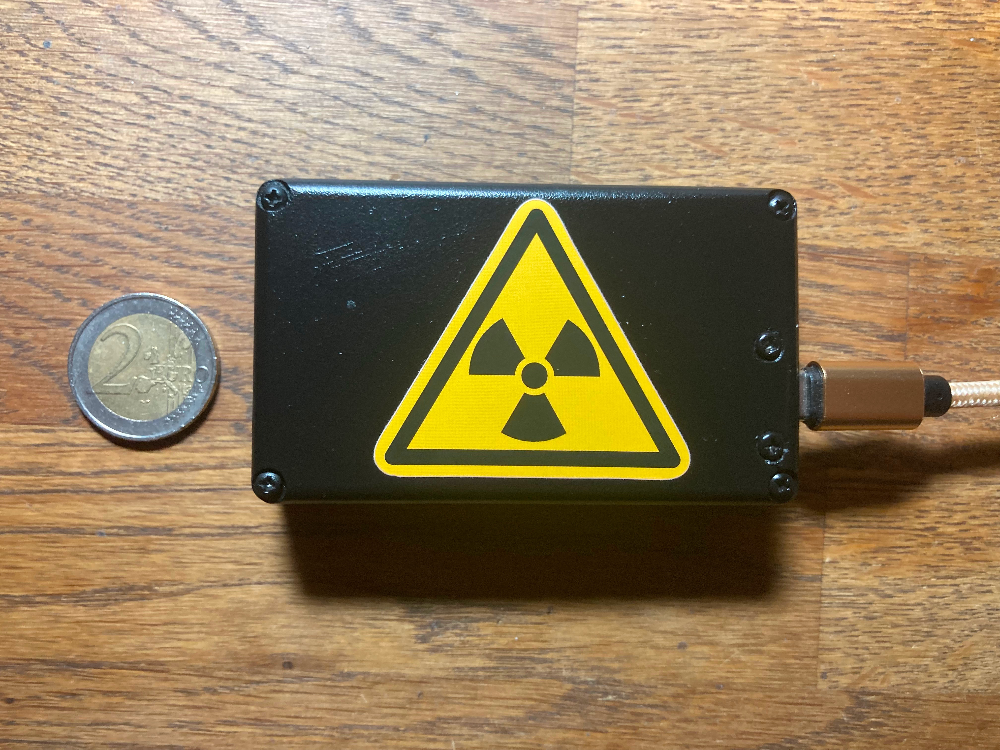
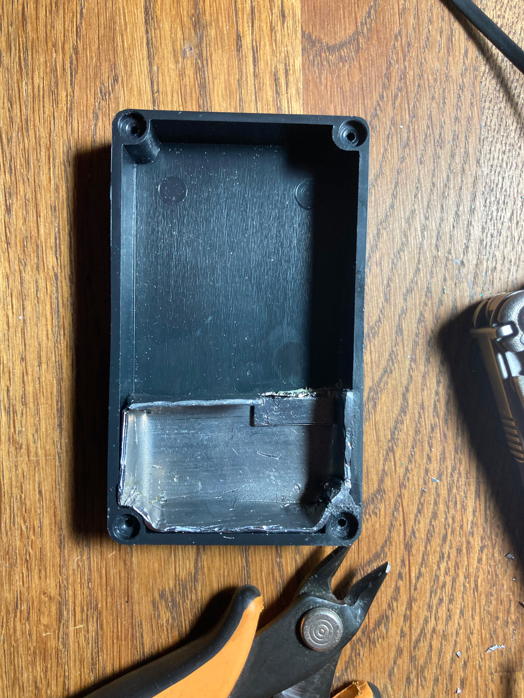
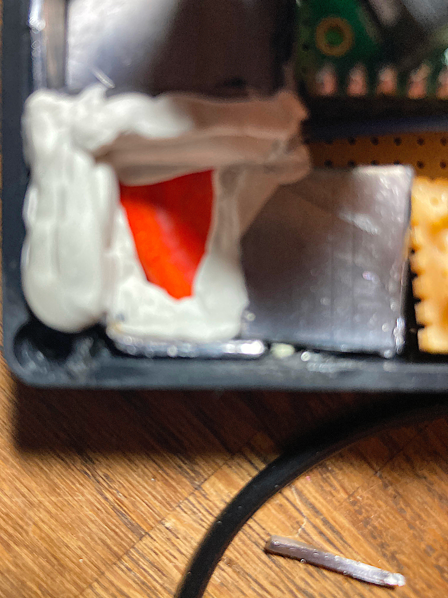
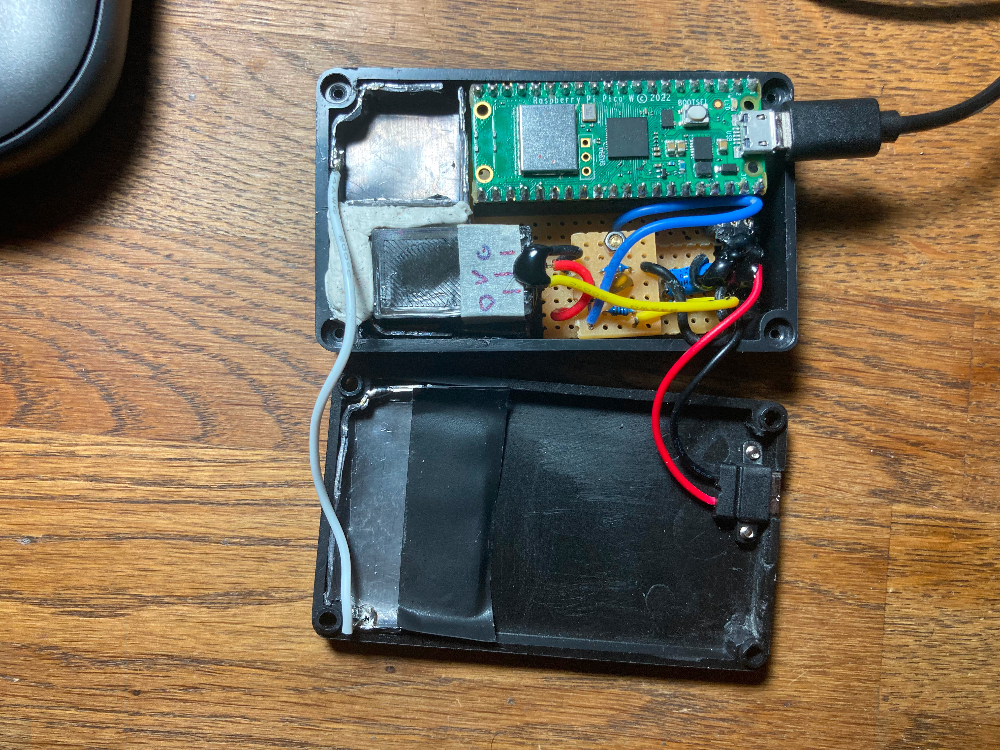
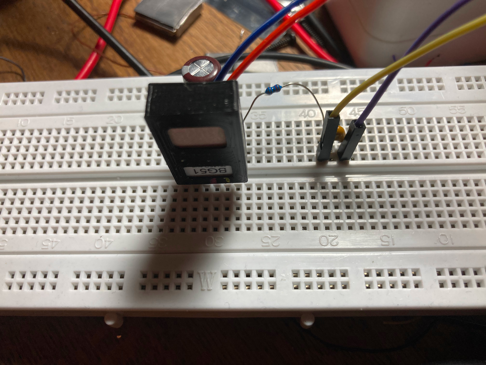
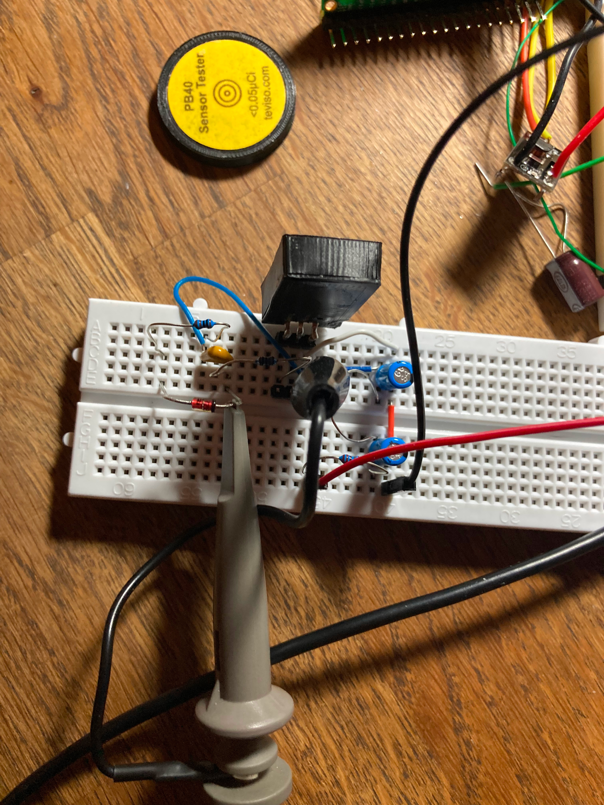

Introduction:
=============

This project is the third variation of the theme "creation of RNG generators based on nuclear decay",  you can find the other two implementations here:

[NuclearRNG Version 1](https://github.com/gbonacini/nuclear_random_number_generator)<BR>
[NuclearRNG Version 2](https://github.com/gbonacini/nuclear_rng_generation2)

This version, differently from the previous two, does not use a Geiger–Müller tube nor a classic Geiger counter but an array of PIN diodes prodiced by Teviso company, named BG51:
 
[BG51 Datasheet](https://www.teviso.com/file/pdf/bg51-data-specification.pdf)

Using that component, the implementation of the present appliance is greatly simplified, avoiding all the high voltage circuitry necessary to operate a Geiger tube. Furthermore, the small dimensions of the component permits to implement a very compact device.



Hardware:
=========

* A Raspberry Pico (RP2040) is employed as microcontroller platform;
* A BG51 radiation sensor;
* Some circuitry to filter the power source and to convert the logic level of the sensor output.

Hardware Details:
=================

* As radiation source, a piece of ceramic colored with uranium oxideis employed. It comes from a salt / pepper dispanser I purchased set from the 50s, unfortunately one was damaged, the handle was broken and that peace is now, temporalely the source of this appliance:


* A lead metallic shield contains both a radiation source and the sensor, fixed with non-permanent glue. The shielding has two functions, prevent radiation to reach the external environment and prevent external interferences, both particles (particle injection attack ? :-) ) and electromagnetic. In fact the product, as stated in datasheets, requires some kind of shielding:




* A circuit to stabilize input voltage is required, I tested also with boards different from Pico having the same results: being the sensor sensible to rumor in the power supply, a filter is mandatory. Testing without filtering in power input, produced distorsions in the output.  I implemented a filter using the specifications in Teviso's manuals and all problems disappeared.

*  Datasheet tell us that at least 4V are required, so I opted for 5V and a small logic level converter to interface the sensor to Pico's 3V logic. This operation could be made with many different solution, I used my own.




Algorithm and Features:
=======================

* In loop, a register with a representation od an unsigned intege is cyclically increased from 0 to its maximum value, when it reaches the maximim it restart from zero. When a particle is detected, the current value is stored in queue ready to be deployed on request;
* Default queue length is 10240 bytes.

Protocol:
=========

* When a socket connects to the appliance via WIFI, a message with the following format is given as response:
```shell
ready\n
```
<sp><sp><sp>where '\n' is "newline" character
* You require a RN sending the message:
```shell
req
```
* Then you'll receive a RN in an answer with the following format:
```shell
<random_number>i<separator><generator_number><separator><available_numbers><newline>
```
<sp><sp><sp>where:
  - the first field is a random number in the range 0-15 or the number 16 if an error was generated or no number is available yet;
  - the second field represent the original value of the register incremented in loop to extract the random number using module operator of integer divisionby the specific range (0-255, 8-bit integers), it's provided as safeguard to verify that the loop cover every possible value for a given event frequency; 
  - the separator is the character ':';
  - then a field with an integer telling you how many RNs are available in the appliance buffer, ready to be requested;
  - a newline ( '\n' ) ends the message.
* Example:
```shell
52:3473460:1384\n
```

* You can terminate the connection with the command:
```shell
end
```
* At the moment, concurrent access is not supported (aka I don't need it for now), so, closing the connection also permits different client to connect;

Dependencies:
=============

* Raspberry Pi Pico SDK
* Cmake

Detailed instruction for dependencies installation are available on Raspberry website.

Configuration:
==============

* Before compiling, is required to edit wifi_credential.hpp inserting Wifi SSID and password.

Installation and Use:
=====================

- compile the program as follow (set -DPICO_SDK_PATH using real pico-sdk path):
```shell
  cd build
  make -f makefile.srv all
```
- deploy the generated binary file named:
```shell
geiger_gen3.uf2 
```
  putting the Pico in "deploy mode" pushing the white button before connecting USB cable and releasing the same button a second after the connection.
- A trivial Python client example is present in "test" directory in the present software distribution.
- The number can be requested from any program able to create Berkeley sockets using the described protocol.

Credits:
========

- Thanks to Teviso company (https://www.teviso.com) that kindly provided the sensor for this project;

